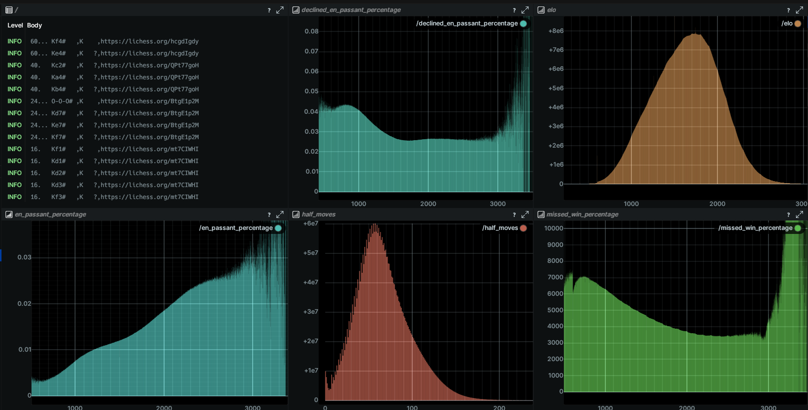

# Rust chess stat recorder

This crate is created for downloading and parsing lichess PGN files, to find statistics and rare checkmates among all games. 

## Visualization

For visualizing stats in real time, Rerun is used. During parsing, the plots update periodically to show new results.

    

## Results
The rare checkmates are currently available in the `rare_checkmates.csv` file. This file can be used to find games where rare checkmates have been played, or could have been played. 